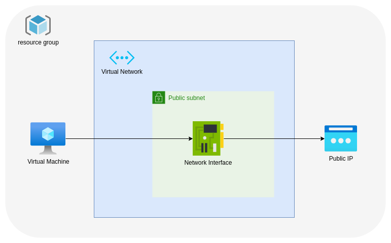

# Brews&Tech Session: Terraform & Azure

## Descripción

Sesión de introducción a Terraform. En este repositorio están los ficheros básicos para poder empezar con Terraform. Después de la sesión se subirá el resto de ficheros para poder desplegar una infraestructura básica en Azure.

Para obtener más información sobre la sesión consultar el [post de basecamp](https://3.basecamp.com/5365202/buckets/27723296/messages/7153559804).

## ¿Qué vamos a ver?

Para las dudas sobre providers y recursos concretos, la documentación de terraform es <https://registry.terraform.io/>.

### Providers

Son los elementos de conexión. En el ejemplo sólo hay uno de tipo "azurerm".

### Resources y data sources.

Los resources son los elementos de la infraestructura. Su tipo está siempre asociado al provider al que pertenece (por ejemplo, "azurerm_virtual_machine").
Los data sources hacen referencia a elementos de la infraestructura que ya están presentes en la misma, pero que necesitamos referenciarlos en nuestro código. Podemos ver un ejemplo en `003_data.tf`.

### Locals y variables

Los __locals__ son el equivalente a variables de entorno. Se pueden encontrar en el fichero `001_locals.tf`
Las variables, por otro lado, se tienen que declarar y a la hora de lanzar el plan o el apply hay que referenciarlas. Se puede ver su declaración en `002_variables.tf` y su asignación en `terraform.tfvars`.

### `terraform init`

Inicializa el entorno. En el ejemplo, es necesario hacer `az login` primero para que pueda acceder a Azure ya que es el provider que usa.

### `terraform plan`

Analiza lo que hay desplegado, lo compara con el código y te dice qué cambios tiene que hacer para que estén idénticos.

### `terraform apply`

Realiza un plan y a continuación lo aplica.

### Tfstate o backend

El comando apply genera el fichero `terraform.tfstate`. Es el estado en el que se encuentra el entorno en el momento actual. En `000_providers.tf` está un ejemplo para generar este fichero en un storage account ya que es recomendable que esté en un sitio privado y común a todos los desarrolladores.

### `terraform destroy`

Elimina toda la infraestructura desplegada.

## Infraestructura

